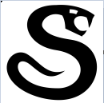
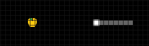
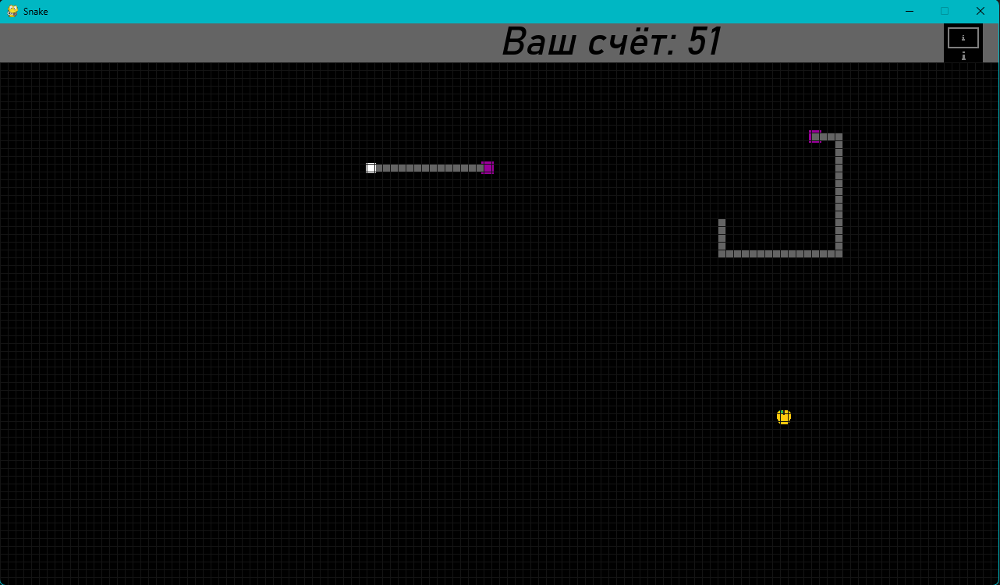
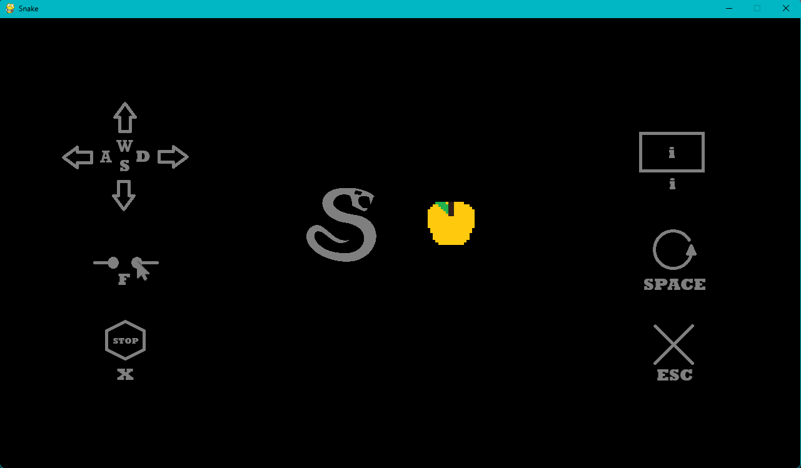

# Snake game
Игра Змейка, вы управляете змеем окоянным и должны собирать яблоки.

При сборе яблока, змей увеличивается в длине. При столкновении с краем экрана или своим хвостом, змей умирает и игра оканчивается. \
Цель игры: набрать максимальное кол-во очков(яблок)

Для отображения подскаски к управлению нужно нажать ' i ', чтобы закрыть подсказку нужно снова нажать ' i ' или ' space '.

    Управление:
     wasd - движение
     f - телепорт к курсору (не может быть использован повторно, пока змей не телепортируется полностью)
     x - остановиться
     i - открыть окно с подсказками к управлению (ставит игру на паузу)
     Space - перезапустить
     Esc - закрыть игру

#### Инструкция по запуску
 ~~Запустить файл snake.exe~~ (На незнакомые exe файлы ругается любой уважающий себя антивирус, поэтому в топку это)\
~~или~~ \
 Установить зависимости из файла requirements.txt \
 С помощью Python3 выполнить файл snake.py 

Удачи!

